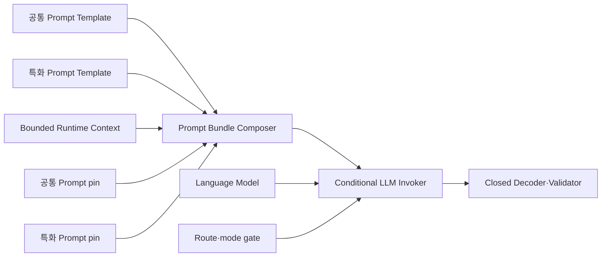
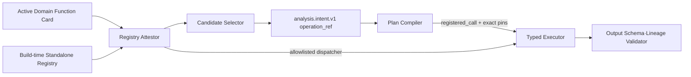

# Architecture Contract

## 1. 목표 구조

```mermaid
flowchart LR
    A["00 분석 질문 입력"] --> B["02 요청 및 세션 상태 고정"]
    L0["01 사용 가능 메타데이터 불러오기"] --> B
    B --> C[Metadata and Resolved Candidate Selector]
    C --> D[Deterministic Route Eligibility Gate]
    D -->|deterministic and proof-pinned| E0[Deterministic Intent Builder]
    D -->|intent_llm| E1[Intent Prompt]
    E1 --> E2[Intent LLM]
    E2 --> E3[Intent Decoder]
    C -->|trusted exact bundle or immutable ref| E0
    C -->|trusted exact bundle or immutable ref| E3
    E0 --> F[Common Intent Contract Validator]
    E3 --> F
    D -->|unsupported| Z[Canonical Unsupported Response and Telemetry]
    C -->|trusted exact bundle or immutable ref| G[Metadata Resolver and Plan Compiler]
    C --> S0[Registered Function Registry Attestor]
    F -->|same normalized intent with bundle and route proof hash| G
    G --> H[Plan Validator]
    H --> I[Parameter Binder and Thin Job Router]
    I --> J1["12 Oracle 데이터 조회"]
    I --> J2["13 H-API 데이터 조회"]
    I --> J3["14 Datalake 데이터 조회"]
    I --> J4["15 Goodocs 데이터 조회"]
    I --> J5["11 검증용 더미 데이터 조회"]
    J1 --> K[Source Contract Merger]
    J2 --> K
    J3 --> K
    J4 --> K
    J5 --> K
    K --> L[Typed Analysis Executor]
    S0 -->|hash-pinned registry projection| L
    L --> M[Result Contract Validator]
    M --> N[Result and Source Ref Store]
    N --> O[Answer Facts Builder]
    O --> P{Narrative mode}
    P -->|deterministic| R[Response Assembler]
    P -->|optional LLM| Q[Answer LLM and Claim Validator]
    Q --> R
    R --> Y[State CAS and Runtime Release Gate]
    Y --> T["24 채팅 메시지 표시 설정"]
    Y --> U["25 API 표준 응답 출력"]
    Y --> V["26 GaiA 형식 출력"]
    T --> W["27 분석 답변 출력"]
    Z --> T
    Z --> U
    Z --> V
```



`deterministic`과 `intent_llm`은 intent 생성 주체만 다르다. 두 경로는 동일한 closed `analysis.intent.v1` schema, bundle pin, Plan Compiler, Validator, Retriever, Executor, state와 terminal을 사용한다. 별도 fast executor나 축약 output contract를 만들지 않는다.

`01 사용 가능 메타데이터 불러오기`는 MongoDB URI·database·timeout만 설정받는다. 고정된 `agent_v6_domain_metadata`, `agent_v6_table_catalog`, `agent_v6_main_filter`에서 가장 최근의 완전한 동일 release를 찾아 자동 결합하며 domain/environment/source mode/collection 선택 input을 노출하지 않는다. `02 요청 및 세션 상태 고정`도 기준시각·시간대 input을 노출하지 않고 내부 현재 시각을 `Asia/Seoul` 기준으로 고정한다.

### 1.1 외부 Prompt topology

위 그림의 `Intent Prompt`와 선택적 Answer prompt는 custom component source에 들어 있는 문자열이 아니다. 두 runtime 단계는 Flow canvas에 공통 Prompt Template과 특화 Prompt Template을 물리적으로 따로 가지며 [PROMPTS.md](PROMPTS.md)의 pair pin과 budget을 따른다.



Prompt Bundle Composer와 Conditional LLM Invoker는 standalone custom component일 수 있지만 prompt instruction을 소유하지 않는다. Composer는 공통/특화 Message와 runtime context를 named input으로 검증하고, Invoker는 검증된 bundle을 수정 없이 조건부 호출한다. 일반 Language Model node에 Prompt Template 출력을 직접 연결해 route와 무관하게 호출하지 않는다.

Metadata authoring은 별도 topology다. Domain/Dataset/Main Filter마다 작업별 공통·특화 Prompt Template을 물리적으로 하나씩 두며, 특화 업무 규칙은 각 특화 Template 본문에 직접 작성한다. 작업자는 세 입력 모두 비정형 자유 자연어 TXT로 작성한다. 최초 bootstrap의 세 분기는 같은 모델 node를 재사용할 수 있지만 출력 계약은 서로 다르다.

```text
Domain TXT      → LLM 최대 1회 → display_name/description annotation only
Dataset TXT     → LLM 최대 1회 → compact metadata.bootstrap.dataset-ir.v1
Main Filter TXT → LLM 최대 1회 → target_type 필수 typed alias IR
                               ↓
Source Registry v3 semantic_templates + dataset descriptors
                               ↓ deterministic expansion/merge
validated metadata.authoring.draft.v1
```

세 분기는 동일 hash의 `semantic_vocabulary`만 공유하고 물리 binding, descriptor 또는 `semantic_templates`는 받지 않는다. `metadata.authoring.source-registry.v3`의 `semantic_templates`는 compiler 전용 실행 의미 구조다. Compiler가 Domain annotation에 metric/relation/grain/ordering/predicate/recipe/entity-group/alias를 결합하고, Dataset IR에 승인 field/source descriptor를, Main Filter IR에 typed alias card를 확장한다. `semantic_templates.planner_policy`는 봉인돼 Domain Policy의 output profile도 바꿀 수 없다. 후속 Dataset/Main Filter Flow도 같은 compact/typed IR과 section-owned expander를 사용한다. 모든 공통·특화 Template은 변수 없이 렌더링되고 source context는 Context Builder에서 Composer의 `runtime_context`로 정확히 한 번 전달된다. Domain Policy는 Prompt Bundle Composer와 provider를 호출하지 않으며, Main Filter의 zero-LLM 경로는 optional `source_grounding_mode=explicit_inventory` proof가 완전할 때만 사용한다. Blueprint/pin 고신뢰 lane은 Domain annotation 계약을 넓히지 않고 executable external pin 검증만 추가한다.

### 1.2 Registered function topology

`specialized_functions`는 runtime catalog에 보존되는 것만으로 실행 가능하지 않다.



- Domain function card에는 code가 아니라 function ID/version, implementation SHA-256, registry-entry SHA-256, input/output schema hash, required field/role, selection policy와 resource policy만 둔다.
- Build-time registry는 각 standalone implementation source와 hash를 Flow/component manifest에 pin한다. Metadata card와 exact identity/hash/schema가 다르면 package activation 또는 plan compile 전에 `metadata_dependency_error`다.
- Candidate Selector는 registry attestation이 끝난 function만 `registered_function_application` candidate로 만든다. Intent LLM은 그 candidate ID만 선택하며 function name, argument, code를 생성하지 않는다.
- Plan Compiler는 typed literal/metadata candidate에서 닫힌 argument binding을 만들고 `op=registered_call`에 exact function/registry pin을 포함한다.
- Typed Executor의 Registered Function Gateway는 dynamic import, `eval`/`exec`, arbitrary network/file/subprocess를 사용하지 않고 build-time allowlist 구현만 호출한다. Timeout, memory, row count, input/output schema와 lineage를 검증하며 실패 후 pandas/LLM fallback은 없다.

## 2. Route와 LLM 호출 계약

Route Eligibility Gate의 출력은 closed `analysis.route.v1`이다.

```json
{
  "contract_version": "analysis.route.v1",
  "route": "deterministic|intent_llm|unsupported",
  "reason_code": "unique_complete_selection|semantic_choice_required|unsupported_registry_gap",
  "resolved_candidate_bundle_sha256": "...",
  "selected_candidate_ids": [],
  "required_slots": [],
  "unresolved_slots": [],
  "ambiguity_sets": [],
  "route_policy_version": "route-policy.v1",
  "eligibility_proof_sha256": "..."
}
```

`deterministic`은 다음을 모두 증명할 때만 선택한다.

- 각 required semantic slot에 applicable candidate가 정확히 하나 있고 selection 전체가 원문 evidence 또는 검증된 follow-up contract에 연결됨
- selected candidate의 metadata/operator revision과 semantics hash가 immutable bundle에 pin됨
- analysis kind, follow-up mode, metric/dimension/filter/time/operation/recipe/formula selection이 완전함
- unresolved slot, alias ambiguity, conflicting candidate, registry 밖 operation이 없음
- route 판단에는 source row 조회, LLM score, 질문별 hardcoded 문자열을 사용하지 않음

하나라도 증명하지 못했지만 bounded candidate 선택으로 해소할 수 있으면 처음부터 `intent_llm`을 선택한다. typed registry 밖 의미가 확정적이면 `unsupported`로 종료한다. Unsupported 응답은 LLM/retrieval/executor/result store/state mutation을 수행하지 않고 이전 turn state를 그대로 유지한다. `deterministic`을 선택한 뒤 intent/plan/retrieval/execution이 실패하면 그 오류를 그대로 반환하며 Intent LLM, pandas 또는 exploration 경로로 자동 fallback하지 않는다.

| Route/모드 | Intent | Intent retry | pandas code | pandas repair | Answer | 정상 합계 |
| --- | ---: | ---: | ---: | ---: | ---: | ---: |
| `deterministic + narrative_off` | 0 | 0 | 0 | 0 | 0 | 0 |
| `deterministic + narrative_on` | 0 | 0 | 0 | 0 | 1 | 1 |
| `intent_llm + strict` | 1 | 0 | 0 | 0 | 0 | 1 |
| `intent_llm + balanced` 기본 | 1 | 0 | 0 | 0 | 1 | 2 |
| `unsupported` | 0 | 0 | 0 | 0 | 0 | 0 |

Intent retry는 사용하지 않는다. JSON syntax/schema 오류, candidate 밖 ID, provider 오류와 semantic ambiguity를 재호출로 추측하지 않고 clarification 또는 canonical contract error로 처리한다.

Answer LLM은 선택 사항이다. 실패하거나 claim validator를 통과하지 못하면 deterministic answer가 최종 응답이 된다.

## 3. Node responsibility

| 단계 | 입력 | 출력 | 핵심 책임 |
| --- | --- | --- | --- |
| `01 사용 가능 메타데이터 불러오기` | MongoDB URI·database·timeout | 검증된 domain runtime bundle | 고정 3컬렉션의 최신 완전 release 자동 탐색·hash 검증·결합 |
| `02 요청 및 세션 상태 고정` | question, authenticated subject/session ID, domain bundle | `request.capsule.v1` | 내부 현재 시각·`Asia/Seoul` 기준 typed literal/date 후보·owner-bound 이전 ref·실행 모드 |
| Candidate Selector | request capsule, metadata index, operator registry | `metadata.bundle.v1` + exact `resolved.candidate.bundle.v1` 또는 content-addressed immutable ref/hash | 관련 record/dependency closure와 immutable resolved semantics; LLM에는 bounded card projection만 제공 |
| Route Eligibility Gate | request/state evidence, exact resolved candidate bundle, route policy | `analysis.route.v1` | selection uniqueness/completeness/registry support 증명, route reason/proof hash 고정; source/LLM 호출 없음 |
| Runtime Common Prompt Source | versioned 공통 Prompt Template node | common prompt Message | Intent/Answer 공통 schema·안전·출력 계약의 유일한 소유자; Flow manifest pin |
| Runtime Specialized Prompt Source | versioned 특화 Prompt Template node | domain prompt Message | Template 본문에 직접 작성한 runtime domain terminology·해석·표현 정책만 소유; 동적 변수 없음 |
| Authoring Common Prompt Source | Domain/Dataset/Main Filter별 Prompt Template node | authoring common Message | 작업별 section ownership과 closed output 계약 |
| Authoring Specialized Prompt Source | Domain/Dataset/Main Filter별 별도 Prompt Template node | authoring specialized Message | Template 본문에 직접 작성한 작업별 용어 해석 규칙; 동적 변수 없음 |
| Runtime Context Builder | request/candidate/facts/authoring source의 bounded projection | allowlisted runtime context Data | Prompt Template에 payload 복제 없음; raw row/full catalog/secret/query 차단 |
| Prompt Bundle Composer | common Message, specialized Message, runtime context, independent pins | direct structured prompt bundle + hash-only `prompt.envelope.v1` manifest | named authority/purpose/revision/hash/byte budget 검증; prompt 지속화 금지 |
| Conditional LLM Invoker | route 또는 mode, validated prompt envelope, model object | provider raw response와 call telemetry | prompt 수정 없이 허용 경로에서만 호출; 내부 default/retry 문구 금지 |
| Deterministic Intent Builder | deterministic route proof, exact resolved candidate bundle | `analysis.intent.v1` | proof에 pin된 candidate selection을 공통 intent schema로 변환; 의미 추가 없음 |
| Intent Decoder | LLM selection, intent_llm route proof, exact resolved candidate bundle 또는 integrity-verified immutable ref/hash | `analysis.intent.v1` | recursive closed JSON schema, candidate membership/hash/applicability 검증 후 trusted bundle/route proof hash 부착 |
| Common Intent Validator | deterministic 또는 LLM intent | validated `analysis.intent.v1` | 생성 경로와 무관한 exact closed contract와 hash 검증 |
| Plan Compiler | intent, exact resolved candidate bundle, metadata bundle, executed-result contract projection | `analysis.plan.v1` | candidate semantics를 dataset/date/declarative binding spec/mapping/operator/output으로 결정론적 확장 |
| Plan Validator | plan | validated plan | 완전성·lineage·cardinality |
| Parameter Binder/Router | validated plan, authenticated state/result refs | `retrieval.job_bundle.v1` | owner-bound entity value resolve·required parameter·thin job 확정 |
| `11~15` Source Retrievers | source별 thin jobs, domain bundle, 연결된 source payload | `source.result.v1` | Dummy/Oracle/H-API/Datalake/Goodocs를 분리 처리; 운영자 조절 scalar는 실제 source별 조회 행 수 제한만 허용 |
| Source Merger | source results | `source.bundle.v1` | canonicalization·중복/스키마 검사 |
| Executor | plan, source bundle | `analysis.result.v1` | typed operators 실행 |
| Registered Function Registry Attestor | active function cards, build manifest/registry | exact hash-pinned registry projection | function identity/source/schema/resource pin 검증; code·callable 직렬화 금지 |
| Registered Function Gateway | `registered_call`, canonical frame, attested registry | typed canonical frame/scalar | standalone allowlist 구현만 resource-bounded 호출; I/O schema·lineage 검증 |
| Result Validator | result, plan | validated result | exact schema·ordering·lineage |
| Result/Source Store | validated result와 source snapshot | owner-bound result/source refs | full row TTL 저장; final follow-up contract는 아직 만들지 않음 |
| Answer Facts | result | `answer.facts.v1` | 값·조건·notice의 단일 근거 |
| Response Assembler | facts, optional prose, refs, plan/trace projection | immutable `response.v1` + `executed.result.v1` + next `turn.state.v1` | 표·메시지, durable explain evidence, compact next state 조립 |
| State/Release Gate | response, executed contract, next state, frame handles | immutable `response.v1` | executed contract publish와 owner/session state CAS 성공 후 frame 해제 |
| `24 채팅 메시지 표시 설정` | response, `display.options.v1` | `Message` | `response.v1` schema만 검사하고 v5 표시 옵션 적용; 전송 hash를 재검사하거나 structured payload를 변경하지 않음 |
| `25 API 표준 응답 출력` | response | `Data`, `is_output=True` | 일반 JSON 응답을 Message 역파싱이나 수신 hash 비교 없이 반환 |
| `26 GaiA 형식 출력` | response | `Message` + `gaia.metadata.v1` Data | 일반 JSON 응답에서 answer·download URL·follow-up·trace/usage 변환; 수신 hash 비교 없음 |
| Unsupported Telemetry | unsupported route/error의 bounded shape | counter/trend evidence | missing role/operator/formula/recipe와 metadata pin 집계; row/secret/prompt 저장 금지 |

## 4. Target complexity budget

- Data Analysis custom component: 목표 26 nodes 이하, source adapter 수에 따라 예외 허용. Native Chat I/O와 서로 다른 type의 terminal output은 제외한다.
- 정상 LLM 호출: route에 따라 0~2, Intent LLM은 0 또는 1
- default path의 free-form code execution: 0
- 질문별 Python exception rule: 0
- 한 node가 full source rows와 full result rows를 동시에 downstream envelope로 직렬화·전달·지속화: 금지
- source rows가 LLM edge를 통과: 금지
- custom component source 또는 standalone generator가 LLM instruction, retry suffix, provider별 fallback prompt를 포함: 금지
- Runtime 공통·특화 instruction을 한 Prompt Template node에 합치거나 같은 runtime context를 두 template에 중복 전달: 금지
- 특화 Prompt 본문을 사용자 입력·metadata 변수로 동적 교체하거나 공통 Prompt와 한 Template에 합치기: 금지
- prompt text가 state/result/trace/telemetry에 저장되거나 downstream 공용 payload에 복제: 금지
- executor peak memory: visible `max_executor_memory_mb` node input과 operator estimate/runtime measurement로 제한

Node 수 자체보다 책임의 중복 여부가 우선이다. 두 node가 같은 mapping, result schema 또는 state를 각자 재해석하면 합치거나 계약 소유자를 하나로 정한다.

Message/API/GaiA는 서로 다른 소비자 계약이므로 Message 문자열 하나로 합치지 않는다. 세 terminal은 같은 immutable `response.v1`을 소비하며, 표시 옵션이나 adapter가 plan/result를 다시 해석하지 않는다. 채팅 표시는 schema만 검사하고, 외부 전송 경계인 API와 GaiA가 응답 hash를 검증한다.

Pandas-backed executor가 한 operation을 계산하는 동안 input/output frame을 일시적으로 함께 메모리에 두는 것은 허용한다. 다만 peak memory를 측정하고, chunk/stream 가능 operator는 budget을 적용하며, result validation/store가 끝나면 source frame reference를 해제한다. source와 result의 full copy를 payload/state/trace에 동시에 남기는 것은 허용하지 않는다.

## 4.1 한국어 UI와 Sticky Note 계약

내부 node ID, component class, input/output `name`, schema key, enum과 endpoint name은 변경하지 않는다. 대신 사용자가 Langflow canvas에서 보는 다음 항목은 한국어를 기본으로 한다.

- Flow 이름과 설명
- native/custom node `display_name`과 `description`
- input `display_name`과 `info`: 기능, 필수/선택, 기대 contract/type, 값의 소유자와 주요 consumer
- output label과 설명: 반환 contract/type, 다음 연결 대상, canonical result 변경 여부

고유 명사나 schema ID는 `의도 계약 (analysis.intent.v1)`처럼 한국어 설명 뒤에 병기할 수 있지만 영문 identifier만 단독 표시하지 않는다. Localization overlay는 source of truth inventory에서 builder가 적용하고 internal edge/port/hash 의미를 바꾸지 않는다.

Sticky Note는 Langflow 1.9.2의 `noteNode`/`data.type=note`로 builder가 생성한다. Note는 edge가 없고 실행 node 수·LLM call count에 포함하지 않으며 deterministic note ID와 layout group을 가진다.

- Data Analysis: 시작/필수 설정, 최신 3컬렉션 자동 결합, Runtime 공통·특화 Prompt와 LLM 0/1회 route, 분리된 5개 source adapter, Typed IR·`registered_call`, Message/API/GaiA·multi-turn 출력 Note
- Domain/Dataset/Main Filter authoring: 자연어 입력 범위, 작업별 공통·특화 Prompt pair, section ownership, 검증→3컬렉션 transaction 저장, 결과/collection Note
- Domain Policy authoring: explicit 관리자 입력, LLM 0회, registered function card는 pre-registered hash만 참조한다는 Note

Note에는 secret, URI, query, raw row, prompt 원문 전체와 특정 배포 환경의 실제 값이 들어가면 안 된다. Builder가 Flow wiring이나 contract를 바꾸면 관련 Note text/revision도 함께 갱신하고 stale-note validation을 통과해야 한다.

## 5. Model-independent의 정확한 의미

임의의 모든 LLM을 보장한다는 뜻은 아니다. 지원 모델의 최소 계약은 다음과 같다.

- 짧은 candidate ID 목록에서 semantic concept를 선택할 수 있음
- 작은 JSON schema를 반환할 수 있음
- temperature 0 반복 conformance suite를 통과함

모델이 위 계약을 통과하지 못하면 runtime fallback을 늘리지 않고 unsupported model로 분류한다. 모델의 표현 차이는 허용하지만 source lineage, filters, dates, operation DAG, output schema는 model이 결정하지 않는다.

Deterministic route case는 모델 conformance 대상이 아니라 **모델 비호출 계약**의 대상이다. 같은 endpoint를 어떤 model profile로 실행하더라도 provider call count가 0이고 eligibility proof, normalized intent, plan과 result가 동일해야 한다.

## 6. Error boundary

각 오류는 최초 발생 단계에서 종료한다.

- `intent_contract_error`
- `route_contract_error`
- `metadata_dependency_error`
- `metadata_budget_exceeded`
- `plan_contract_error`
- `missing_required_param`
- `parameter_value_limit_exceeded`
- `ambiguous_alias`
- `ambiguous_field_binding`
- `source_missing`
- `source_retrieval_failed`
- `source_timeout`
- `source_row_limit_exceeded`
- `source_acl_denied`
- `source_schema_mismatch`
- `source_coverage_incomplete`
- `unsupported_operation`
- `execution_memory_limit_exceeded`
- `metric_rollup_violation`
- `metric_lineage_violation`
- `join_cardinality_violation`
- `result_schema_violation`
- `state_reference_expired`
- `state_reference_forbidden`
- `state_conflict`
- `answer_claim_violation`
- `approval_not_found`
- `approval_expired`
- `approval_hash_mismatch`
- `approval_already_claimed`
- `stale_candidate`
- `registered_function_timeout`
- `registered_function_contract_violation`

후속 단계가 오류를 0, 빈 문자열, 다른 metric 또는 새 컬럼으로 숨기면 안 된다.

Registered function card/registry identity·hash·schema가 활성화 전에 맞지 않으면 `metadata_dependency_error`, plan의 argument binding이 닫히지 않으면 `plan_contract_error`다. 실행 timeout은 `registered_function_timeout`, 반환 type/schema/grain/lineage 위반은 `registered_function_contract_violation`이다. 이 오류도 다른 typed op, LLM 또는 pandas code로 fallback하지 않는다.

`source_missing`은 plan이 요구한 source record 또는 branch가 존재하지 않는 경우, `source_retrieval_failed`는 존재하는 source 호출이 transport/provider 오류로 실패한 경우다. 성공적으로 조회한 0행은 error가 아니라 `empty` status다.

모든 component는 위 registry ID와 아래 canonical payload만 사용한다. 새 error는 registry, `error.schema.json`, fault-injection case를 함께 추가해야 한다.

```json
{
  "error_registry_version": "error_registry.v1",
  "error_id": "error:...",
  "code": "missing_required_param",
  "stage": "plan_validation",
  "message": "사용자에게 공개 가능한 설명",
  "retryable": false,
  "details": {"job_id": "hold_history", "parameter": "LOT_ID"},
  "trace_id": "trace:..."
}
```

`details`에는 secret, SQL, raw source row, provider response body를 넣지 않는다.

## 7. Unsupported telemetry와 promotion

`unsupported_operation`은 조용히 폐기하지 않고 다음 bounded 정보만 집계한다.

- normalized request-shape ID와 error/reason code
- 부족한 registered field role, operator, formula, recipe 또는 join capability ID
- metadata/operator registry version과 route policy version
- occurrence count, 최초/최근 시각, 검증용 anonymized case reference

원문 전체, source/result row, credential, query body, prompt/LLM raw output은 telemetry에 넣지 않는다. 반복 수요는 별도 review에서 의미·grain·null/cardinality/zero 정책을 정의하고 metadata recipe, formula AST 또는 typed operator와 canonical regression case를 함께 추가한 뒤에만 trusted core로 승격한다. runtime이나 LLM이 telemetry만 보고 operator를 자동 생성하거나 arbitrary pandas code를 승인된 기능으로 바꾸면 안 된다.

## 8. Future privileged exploration contract

초기 v6 runtime과 다섯 개 MVP Flow에는 자유 pandas 실행이 없다. 미래 수요를 위한 namespace만 예약한다.

- `exploration.request.v1`: 사용자가 명시적으로 선택한 별도 작업 요청
- `exploration.job.v1`: immutable, owner/tenant/session-bound `result_ref` snapshot과 policy/image/code hash
- `exploration.response.v1`: `untrusted_exploration` classification, bounded scalar/Series/table 결과와 audit ref
- `exploration_ref`: trusted `result_ref`, `source_ref`, `turn.state.v1`와 구분되는 별도 prefix/store/TTL/ACL

향후 활성화하더라도 Langflow는 submit/status/cancel의 thin façade만 담당하고 실제 실행은 외부 broker와 per-job hypervisor/microVM급 격리 계층이 담당한다. 자동 routing/fallback, core source 직접 접근, cross-result join, core Message/API/GaiA terminal 재사용, Answer LLM 연결, multi-turn state 상속, download/chaining/promotion은 기본 금지다. 별도 threat model·adversarial gate·운영 승인이 완료되기 전까지 endpoint와 worker는 disabled이며 `flow_inventory`의 trusted 다섯 Flow에 추가하지 않는다.
