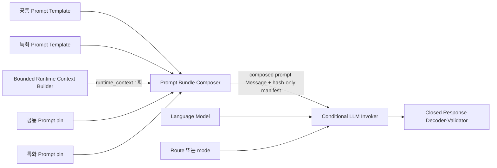
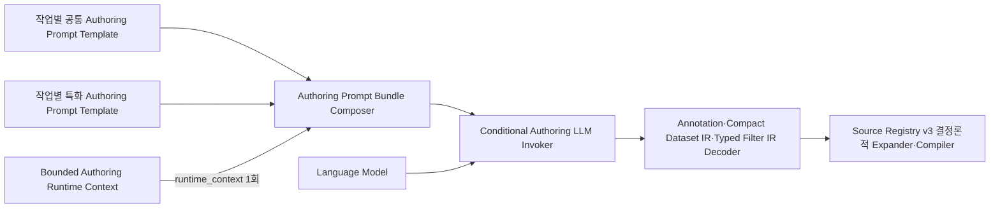

# External LLM Prompt Topology Contract

## 1. 목적과 범위

v6에서 LLM이 사용하는 모든 instruction은 Langflow canvas의 외부 **Prompt Template node**가 소유한다. LLM을 호출하는 Runtime Intent/Answer와 Domain/Dataset/Main Filter authoring은 모두 공통·특화 Prompt Template을 물리적으로 분리한다.

- **Runtime Intent/Answer**: 공통 Prompt Template과 도메인 특화 Prompt Template을 반드시 물리적으로 분리한다. 두 node는 서로 다른 node ID, prompt ID, revision, source file, SHA-256과 출력 edge를 가진다.
- **Domain/Dataset/Main Filter authoring**: 각 작업에 공통 Prompt Template과 특화 Prompt Template을 하나씩 둔다. 특화 업무 규칙은 해당 특화 Template 본문에 직접 작성한다.
- **Domain Policy**: Prompt Template과 LLM 호출이 모두 0회다. Main Filter의 zero-LLM 경로는 `source_grounding_mode=explicit_inventory`에서 완전한 binding proof가 있을 때만 선택적으로 사용한다.

공통과 특화를 한 Prompt Template node 안에 section이나 변수로 합치는 것은 금지한다. 특화 Template은 runtime 변수를 받지 않으며 질문이나 metadata로 본문을 동적으로 교체하지 않는다.

custom component와 이를 생성하는 Python builder에는 system/user instruction, 도메인 예시, retry instruction 또는 provider별 fallback prompt를 작성하지 않는다. 사용자 공개 오류 메시지와 deterministic schema validation 설명은 LLM instruction이 아니므로 허용한다.

Standalone은 업무 prompt까지 source에 내장한다는 뜻이 아니다. component가 sibling Python import 없이 동작하고, purpose가 요구하는 외부 prompt Message를 명시적 Langflow input으로 받아 누락·pin 불일치 시 fail-closed하면 standalone 계약을 만족한다.

## 2. Purpose별 Prompt 소유권

| Purpose | 필수 공통 Prompt Template | 특화 Prompt Template | 호출 조건 |
| --- | --- | --- | --- |
| `intent_selection` | `공통 의도 선택 프롬프트` | `도메인 특화 의도 해석 프롬프트` **필수** | route=`intent_llm` |
| `answer_narrative` | `공통 답변 생성 프롬프트` | `도메인 특화 답변 생성 프롬프트` **필수** | narrative enabled |
| `domain_authoring` | `도메인 등록 공통 프롬프트` | `도메인 등록 특화 프롬프트` **필수** | 자유형 자연어를 작은 `section/key/payload` items로 변환 |
| `domain_blueprint_annotation` | `도메인 등록 공통 프롬프트` | `도메인 등록 특화 프롬프트` **필수** | 같은 annotation 계약에 Blueprint/external pin 불변성 검증을 추가한 고신뢰 lane |
| `dataset_authoring` | `데이터셋 등록 공통 프롬프트` | `데이터셋 등록 특화 프롬프트` **필수** | 자유형 dataset 설명을 작은 `dataset_cards` 목록으로 변환; SQL은 원문 추출 |
| `main_filter_authoring` | `기본 필터 등록 공통 프롬프트` | `기본 필터 등록 특화 프롬프트` **필수** | 자유형 표현을 `filter_key/payload` items로 변환; compiler가 field alias card로 확장 |
| `domain_policy` | 없음 | 없음 | LLM 0회 |
| `main_filter_explicit_inventory` | 없음 | 없음 | optional explicit-inventory proof가 완전할 때 LLM 0회 |

Runtime 공통 Prompt에는 공통 역할·안전·closed output 원칙만 둔다. Runtime 특화 Prompt에는 배포 대상 업무의 terminology, 해석 우선순위와 답변 표현 정책을 Template 본문에 직접 작성한다. question, bounded candidate cards와 facts 같은 runtime context는 두 Prompt Template 어디에도 복제하지 않고 Prompt Bundle Composer의 `runtime_context` 입력으로 정확히 한 번만 전달한다.

Authoring 공통 Prompt는 해당 작업의 출력 경계와 closed output schema를 소유한다. Domain 기본 branch는 `metadata-annotation-proposal.schema.json`의 표시명·설명만 반환한다. Dataset은 compact Dataset IR, Main Filter는 모든 alias addition에 `target_type`, `target_id`, `expressions`를 요구하는 typed IR만 반환한다. 자연어 source block과 schema projection은 Prompt Template에 복제하지 않고 Authoring Runtime Context Builder가 Composer의 `runtime_context`에 한 번만 전달한다. Authoring 특화 Prompt는 작업별 용어 해석 규칙만 소유하며 공통 schema·소유권·보안 규칙을 변경할 수 없다.

세 branch의 외부 envelope는 `metadata-authoring-proposal.schema.json` 하나다. `status=complete`이면 exact `source_sha256`와 branch별 closed `draft`가 있고, 그 `draft`는 Domain annotation, compact Dataset IR 또는 typed Main Filter IR 중 purpose가 pin한 하나와 일치해야 한다. `status=needs_clarification`이면 exact source hash와 `clarification.questions` 1~3개 및 `missing_fields`만 있다. 두 variant를 섞거나 clarification에 draft/candidate/persist를 넣을 수 없다.

현재 import-ready 등록 Flow에서는 source registry나 그 안의 `semantic_vocabulary`를 LLM context에 넣지 않는다. LLM에는 작업자의 자연어 원문, 해당 등록 종류에만 닫힌 출력 schema, 공통 Prompt Template, 선택형 특화 Prompt Template만 전달한다. 테이블의 물리 컬럼·원천 종류·조회문과 메인 필터 대상은 자연어 원문에서 구조화하되, 저장 전 compiler가 schema·참조·read-only 정책을 검증하고 세 MongoDB 컬렉션이 완성된 뒤 전체 실행 계약을 다시 컴파일한다. 과거 registry 기반 template 확장 경로는 마이그레이션 및 내부 회귀 검증 전용이다.

## 3. 필수 node 경계

### 3.1 Runtime Intent/Answer



- **공통 Prompt Template**: 공통 instruction과 closed output contract를 소유한다.
- **특화 Prompt Template**: domain/공정/업무에만 필요한 instruction을 소유하며 공통 schema·보안 규칙을 변경할 수 없다.
- **Bounded Runtime Context Builder**: prompt 문구를 만들지 않고 typed/allowlisted runtime context를 작은 Data로 한 번만 만든다.
- **Prompt Bundle Composer**: Runtime에서는 `common_prompt_message`, `specialized_prompt_message`, `runtime_context`라는 named input을 받고 각 segment의 authority/pin과 전체 byte budget을 검증한다. component 자체에는 instruction이 없다.
- **Conditional LLM Invoker**: 검증된 composed prompt를 수정 없이 provider에 전달한다. route/mode가 허용하지 않으면 호출하지 않는다.
- **Closed Decoder/Validator**: JSON/schema/candidate membership/fact claim을 검증하며 prompt로 결과를 보정하지 않는다.

공통·특화 Prompt Template은 모두 runtime variable을 갖지 않는다. 각 특화 Template의 업무 문구는 source Markdown과 Flow node 본문에 정적으로 들어가며 `expected_prompt_variables=[]`여야 한다. Flow builder는 변수 포트나 Template 입력 edge가 생기거나 import 후 port가 달라지면 실패시킨다.

일반 Language Model node에 두 prompt를 직접 연결하지 않는다. Language Model node는 model object만 제공하고 Conditional LLM Invoker가 route/mode와 prompt pair attestation을 확인한 뒤 `invoke()`한다.

### 3.2 Metadata authoring



- Domain/Dataset/Main Filter의 LLM 경로에는 purpose별 공통·특화 Prompt Template이 정확히 한 개씩 있다.
- 공통·특화 Message는 서로 다른 node/source/hash/edge로 Composer의 `common_prompt_message`와 `specialized_prompt_message`에 연결한다.
- Authoring 특화 Prompt 본문은 Flow 배포자가 직접 관리하며 작업자 TXT나 metadata 값으로 동적으로 바꾸지 않는다.
- Domain Policy는 Runtime Context Builder, Composer와 Invoker를 실행하지 않는다. Main Filter는 optional explicit-inventory proof가 완전한 경우에만 이 zero-LLM 경로를 사용한다.
- 입력 TXT가 공통·특화 prompt text를 생성하거나 변경할 수 없다.
- 작업자 TXT는 JSON·ID inventory·relation/field-role 선언 문법을 따를 필요가 없다. bootstrap context는 Domain·Dataset·Main Filter 원문 bundle 또는 동등하게 완전한 자연어 설명을 받는다. 세 분기는 같은 승인 축약 의미 어휘(`id`, dataset `family`, 업무용 `labels`)를 받으며, 작업자 표현을 그 후보에 매핑한다. 물리 컬럼·타입·adapter/config/query ref·실제 데이터와 `semantic_templates`는 authoring LLM context에 넣지 않는다.

## 4. `prompt.envelope.v1`

Prompt Bundle Composer는 composed prompt Message와 함께 prompt text가 없는 manifest를 만든다.

```json
{
  "contract_version": "prompt.envelope.v1",
  "purpose": "intent_selection",
  "segments": {
    "common": {
      "prompt_id": "analysis.intent.common.v1",
      "authority": "system",
      "revision": 1,
      "template_sha256": "<64 lowercase hex>",
      "rendered_sha256": "<64 lowercase hex>"
    },
    "specialized": {
      "prompt_id": "analysis.intent.domain.v1",
      "authority": "domain_policy",
      "revision": 1,
      "template_sha256": "<64 lowercase hex>",
      "rendered_sha256": "<64 lowercase hex>"
    }
  },
  "runtime_context_sha256": "<64 lowercase hex>",
  "composition_sha256": "<64 lowercase hex>",
  "rendered_sha256": "<64 lowercase hex>",
  "byte_length": 0,
  "contains_raw_rows": false,
  "contains_secrets": false
}
```

실제 composed prompt text는 direct Message edge에서만 전달한다. manifest, trace, state, result, telemetry에는 prompt text나 LLM raw output을 저장하지 않는다.

`intent_selection`, `answer_narrative`, `domain_authoring`, `domain_blueprint_annotation`, `dataset_authoring`, `main_filter_authoring`에서는 `segments.common`과 `segments.specialized`가 모두 필수다. Domain Policy와 optional explicit-inventory Main Filter는 `prompt.envelope.v1`을 만들지 않는다.

## 5. 결합·우선순위·변경 규칙

Composer는 순서만으로 우선순위를 표현하지 않는다. Runtime과 Authoring 모두 `common_prompt`는 `system`, `specialized_prompt`는 더 낮은 `domain_policy`, runtime context는 `untrusted_data` authority로 고정한다. Named port나 purpose별 segment cardinality가 바뀌면 실패한다. Conditional Invoker는 provider-neutral chat message 구조로 이 authority를 보존한다. 특화 Prompt는 다음을 할 수 없다.

- output schema, candidate-only 제약, fact-claim 제약 변경
- 공통 closed authoring schema 밖의 dataset/field/operator/join/formula key, SQL 또는 Python 생성 허용
- 공통 prompt 무시·대체·재정의 지시
- 새로운 source/credential/endpoint 요구

Runtime·Authoring 공통 Prompt Template에는 domain-specific 문구를 넣지 않는다. 특화 규칙을 바꿀 때는 해당 특화 source와 revision/hash를 함께 갱신하고 Flow를 재생성한다. component가 누락된 공통/특화 node를 내부 default로 대체하거나 두 prompt 사이에 instruction을 삽입하면 안 된다.

Intent, Answer와 authoring LLM은 허용 경로마다 최대 1회 호출한다. malformed JSON, schema 오류, candidate 밖 ID, provider 오류 또는 claim 오류가 발생해도 retry prompt를 만들거나 자동 재호출하지 않는다. Intent/authoring은 canonical error로 종료하고 Answer narrative만 deterministic answer를 사용한다.

현재 live authoring 검증 profile은 exact `gemini-3.5-flash-lite`, temperature 0, provider/model fallback 0, repair LLM 0이다. 제조 bootstrap은 `metadata/authoring/v6_inputs/domain_v6.txt`, `dataset_v6.txt`, `main_filter_v6.txt`를 합친 자유형 source bundle을 사용한다.

공통 또는 특화 prompt를 수정할 때는 해당 prompt ID/revision/template SHA를 독립적으로 갱신한다. 질문별 예외를 추가하지 않으며 deterministic corpus, model conformance, prompt injection, payload budget과 exact Langflow import를 다시 검증한 뒤 Flow bundle과 evidence manifest를 재생성한다.

## 6. 보안과 budget

- source/result raw row, full catalog, SQL/query body, endpoint, credential, token, header는 어느 Prompt Template variable에도 넣지 않는다.
- Intent runtime context에는 bounded candidate card projection만 제공한다.
- Answer runtime context에는 검증된 fact projection과 필요한 최대 preview만 제공한다.
- Authoring runtime context에는 bounded 자연어 source block과 해당 branch가 소유한 폐쇄형 schema projection만 제공한다. 승인 어휘·원천 레지스트리·기존 MongoDB 문서 전체는 provider request에 넣지 않는다. 작업자 형식이 달라져도 context builder가 inventory 문법을 요구하지 않으며, 모호한 경우 확인 질문은 등록 ID나 스키마 용어가 아니라 업무 선택지로 표현한다.
- Runtime·Authoring 특화 Prompt에는 전체 payload를 넣지 않고 배포 대상 업무의 안정된 용어·해석 규칙만 직접 작성한다.
- 사용자·metadata text는 typed variable로 escape/render하고 출력은 closed decoder가 검증한다.
- Runtime과 Authoring은 공통·특화 segment별 budget을 composed 전체 budget과 함께 prompt registry에 pin한다.
- provider 호출 후 prompt Message reference를 해제하며 payload/state/trace에 복제하지 않는다.
- public HTTP `/run` tweak allowlist는 question/session/승인된 source 입력만 허용하고 Prompt Template, pin과 model policy 변경을 거부한다.

## 7. 필수 검증

1. runtime/authoring custom component source와 standalone generator의 LLM instruction literal, 내부 prompt builder와 retry suffix가 0건이다.
2. Intent와 Answer에는 공통·특화 Prompt Template node가 정확히 한 개씩 있고 서로 다른 node ID/source/hash/edge를 가진다.
3. Domain/Dataset/Main Filter LLM 경로에도 작업별 공통·특화 Prompt node가 정확히 한 개씩 있고 서로 다른 node/source/hash/edge를 가진다.
4. 모든 공통·특화 Template의 예상 변수는 빈 집합이며 동적 특화 본문 포트나 Template 입력 edge가 있으면 build가 실패한다.
5. 공통·특화를 한 Template에 합치거나 공통 Prompt에 domain 예외를 합치면 static contract test가 실패한다.
6. Runtime과 Authoring invocation은 두 rendered Message와 valid `prompt.envelope.v1`을 필수 입력으로 받는다.
7. missing segment, swapped role, wrong purpose/revision/hash/variable set, unknown placeholder와 byte budget 초과는 provider 호출 0회다.
8. Prompt Template variable에 raw row/secret/query/full catalog가 들어가면 렌더링 전에 실패한다.
9. 같은 template set+runtime context는 동일 composition hash를 만들고 export/import 후 고정 port와 edge가 동일하다.
10. 공통 prompt만 변경하면 특화 prompt와 component source hash가 불변이고, 특화 prompt만 변경하면 공통/component source hash가 불변이다.
11. deterministic, unsupported, narrative-off, optional explicit-inventory authoring과 Domain Policy 경로는 provider 호출 0회다.
12. Intent/Answer/domain-authoring/dataset/main-filter 허용 경로는 각각 provider 최대 1회이며 retry와 다른 모델 fallback은 0회다.
13. Runtime과 Authoring의 common=`system`, specialized=`domain_policy`, runtime=`untrusted_data` authority와 named port가 뒤바뀌면 provider 호출 전에 실패한다.
14. specialized prompt injection이 unknown candidate ID, 임의 dataset/field/operator/SQL/Python 또는 fact 없는 claim을 만들지 못한다.
15. runtime context가 Prompt Template이나 envelope segment에 중복되지 않는다.
16. prompt 원문과 raw model output이 state/result/trace/API/telemetry에 남지 않는다.
17. public HTTP tweak로 Prompt Template, pin과 model policy를 변경할 수 없다.
18. Langflow 1.9.2에서 Runtime과 Authoring의 고정 common/specialized pair, Composer, Conditional Invoker, branch별 Decoder와 Source Registry v3 expander가 parse/import/run된다.
19. 말투·순서·표현이 다른 자유형 TXT가 기본 lane에서 Domain annotation·compact Dataset IR·`target_type` 필수 Main Filter IR로 decode되며, Blueprint/pin이나 explicit inventory 문장이 없다는 이유만으로 provider 호출 전에 거부되지 않는다.
20. Domain LLM 출력에 metric/relation/recipe/alias/planner policy 같은 실행 section이 있거나 Main Filter 항목에 `target_type`이 없으면 provider 응답을 확장하지 않고 실패한다.
21. `semantic_templates`가 LLM prompt/envelope에 포함되거나 template/planner hash가 Source Registry v3 pin과 다르면 candidate 생성 전에 실패한다.
